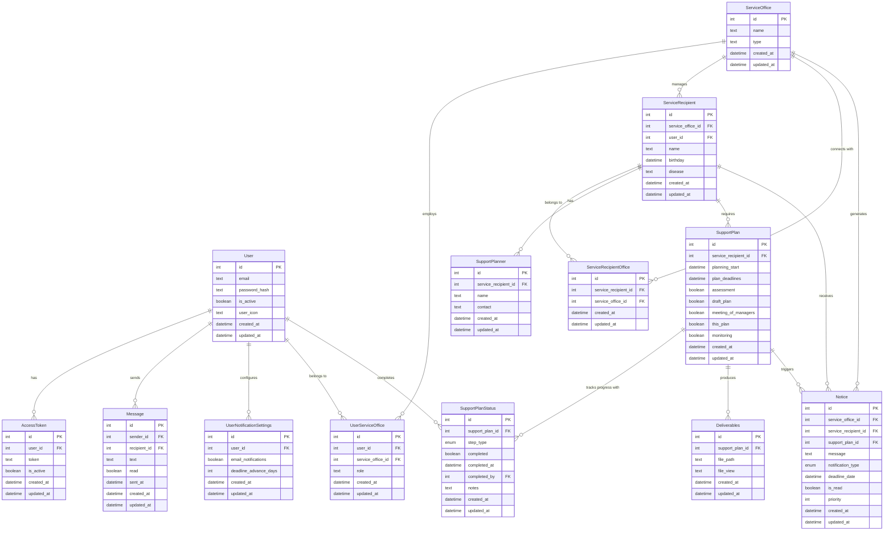

# アプリ名

ケイカくんアプリ

# アプリ概要

B 型事業所の計画支援において、利用者の計画支援のスケジュールを通知してくれるアプリ

# ペルソナ

B 型事業所に勤務するスタッフ

# 解決したい課題

個別支援計画のルーティンは通常 6 ヶ月だが、エクセルでそれらを管理していると非常に分かりづらい
問題点は、支援計画と利用者の個人情報を分散して管理していることで、情報にアクセスしづらくなっている
また、利用者ごとにファイルを作成しているため、いつが個別支援計画の期限なのかが分かりづらい

## 個別支援計画のルーティン

- 1 アセスメント
- 2 計画原案
- 3 担当者会議
- 4 本案
- 5 モニタリング
- 2〜5 を繰り返す
  1 初回のみ
  エクセルで管理・A さん個別支援計画 → シート 1 計画原案　シート 2

# 解決のアプローチ

個別支援計画の期限 1 ヶ月前までに通知が来るようにする(わかりやすい形で)　アプリ内＆メール
個別支援計画 2~5 を実施したらチェックマークがつき、完了したことがわかりやすくなる
利用者の情報を一つに集約し、1 つの画面で利用者全員の個別支援計画の期限が確認できるようにする

# 機能

- 認証機能(Email, Google) jwt 形式
- 利用者一覧表示(支援計画の期限表示)
- 利用者情報の追加、変更、削除
- 通知機能(支援計画の 1 か月前)　-> 誕生月と支援計画の期限が被っていた場合にもお知らせ
  - (メール通知機能)
- 検索：利用者の名前、疾病(フリーワード)期限 1 か月前、誕生月(絞り込み　この 2 つは or 検索)
- 並び替え：名前順　期限の残り少ない順
- 事業所を選択する(ユーザー:スタッフがどの事業所に所属しているか)
- 利用者の計画を手伝うプランナーの情報を表示
- (確認書類を共有する機能)
- (ユーザー同士でメッセージ送信)

# 非機能要件

https://qiita.com/ho_na/items/a84f9a0db793cb0411db

## 可用性

| レベル | 説明                   | 例                                                                                     |
| ------ | ---------------------- | -------------------------------------------------------------------------------------- |
| 1      | 基本的な可用性         | 営業時間内のみの稼働保証。計画停止あり。アップタイム 95%程度                           |
| #2     | 標準的な可用性         | 営業時間＋ α の稼働。計画停止は夜間のみ。アップタイム 97%程度                          |
| 3      | 高可用性               | 24 時間 365 日の基本稼働。計画停止は最小限。アップタイム 99%程度                       |
| 4      | 堅牢な可用性           | 冗長構成によるほぼ無停止運用。アップタイム 99.9%程度（月間約 43 分以下のダウンタイム） |
| 5      | ミッションクリティカル | 完全冗長化・自動復旧機能。アップタイム 99.999%以上（年間約 5 分以下のダウンタイム）    |

## 性能・拡張性

| レベル | 説明         | 例                                                                            |
| ------ | ------------ | ----------------------------------------------------------------------------- |
| 1      | 基本的な性能 | 少数ユーザー向け。応答時間 3 秒以内。単一サーバー構成                         |
| #2     | 標準的な性能 | 中小規模ユーザー向け。応答時間 2 秒以内。シンプルなスケールアップ対応         |
| 3      | 高性能       | 多数ユーザー向け。応答時間 1 秒以内。スケールアウト対応                       |
| 4      | 高負荷耐性   | 大規模ユーザー向け。応答時間 0.5 秒以内。自動スケーリング機能                 |
| 5      | 超高性能     | 超大規模ユーザー向け。応答時間 0.1 秒以内。グローバル分散処理・キャッシュ戦略 |

## 運用・保守性

| レベル | 説明           | 例                                                               |
| ------ | -------------- | ---------------------------------------------------------------- |
| 1      | 基本的な運用   | 手動バックアップ・更新。最小限のログ記録                         |
| #2     | 標準的な運用   | 定期的な自動バックアップ。基本的な監視機能                       |
| 3      | 体系的な運用   | 完全自動バックアップ・リストア機能。詳細なログ記録。アラート機能 |
| 4      | 高度な運用管理 | 包括的な監視・分析ツール。問題の予測・検知。自己診断機能         |
| 5      | 自己修復型運用 | AI 予測分析。自動障害回復。ゼロダウンタイムメンテナンス          |

## 移行性

| レベル | 説明             | 例                                                     |
| ------ | ---------------- | ------------------------------------------------------ |
| 1      | 基本的な移行対応 | 手動によるデータ移行手順。最小限の後方互換性           |
| #2     | 標準的な移行対応 | 基本的な移行ツール提供。一定期間の後方互換性維持       |
| 3      | 計画的な移行対応 | 自動データ変換ツール。段階的な移行パス。長期後方互換性 |
| 4      | シームレスな移行 | 移行中も無停止。自動データ変換・検証。完全な後方互換性 |
| 5      | 透過的な進化     | 完全自動かつ透過的な移行。複数世代のデータモデル共存   |

## セキュリティ

| レベル | 説明                 | 例                                                                        |
| ------ | -------------------- | ------------------------------------------------------------------------- |
| 1      | 基本的なセキュリティ | 基本認証。一般的な脆弱性対策                                              |
| 2      | 標準的なセキュリティ | 2 要素認証。暗号化通信。定期的なセキュリティレビュー                      |
| 3      | 高度なセキュリティ   | 多要素認証。厳格なアクセス制御。侵入検知。定期的な脆弱性診断              |
| #4     | 堅牢なセキュリティ   | 高度な暗号化。リアルタイム監視・対応。定期的ペネトレーションテスト        |
| 5      | 金融・医療水準       | ゼロトラストアーキテクチャ。生体認証。AI による異常検知。全データの暗号化 |

## システム環境・エコロジー

| レベル | 説明                 | 例                                                             |
| ------ | -------------------- | -------------------------------------------------------------- |
| 1      | 基本的な環境配慮     | 省電力モードの提供。不要機能の無効化オプション                 |
| #2     | 標準的な環境配慮     | リソース使用の最適化。クラウドの効率的利用                     |
| 3      | 積極的な環境配慮     | カーボンフットプリント測定。低電力アルゴリズム採用             |
| 4      | 環境最適化設計       | 電力効率を最大化するアーキテクチャ。グリーンエネルギー利用     |
| 5      | カーボンニュートラル | 完全な環境影響評価。カーボンオフセット。100%再生可能エネルギー |

- Amazon EC2
- Amazon RDS
- Amazon S3
- Amazon Cognito
- Amazon WAF
- Amazon KMS
- Amazon SES
- Amazon SNS
- AWS Backup
- Amazon ELB
- AWS Lambda

# github actions CI/CD

# 開発手法

TDD モック jest

# データ設計

User

```
id: int(PK)
email: text not null unique
password_hash: text not null
is_active: boolean default true
user_icon: text
created_at: datetime default=datetime.jstnow
updated_at: datetime default=datetime.jstnow
```

AccessToken

```
id: int(PK)
user_id: int(FK=user.id)
session_token: text
is_active: boolean default=true
created_at: datetime default=datetime.jstnow
updated_at: datetime default=datetime.jstnow
```

Message

```
id: int(PK)
sender_id: int(FK=user.id)
recipient_id: int(FK=user.id)
text: text
read: boolean
sent_at: datetime
created_at: datetime default=datetime.jstnow
updated_at: datetime default=datetime.jstnow
```

ServiceRecipient

```　　
id: int(PK)
service_office_id: int(FK=service_office.id not null)
user_id: int(FK=user.id)
name:  text(30) not null
birthday: datetime
disease: text
created_at: datetime default=datetime.jstnow
updated_at: datetime default=datetime.jstnow
```

UserServiceOffice

```
id: int(PK)
user_id: int(FK=user.id)
service_office_id: int(FK=service_office.id)
role: text
created_at: datetime default=datetime.jstnow
updated_at: datetime default=datetime.jstnow
```

ServiceRecipientOffice

```
id: int(PK)
service_recipient_id: int(FK=service_recipient.id)
service_office_id: int(FK=service_office.id)
created_at: datetime default=datetime.jstnow
updated_at: datetime default=datetime.jstnow
```

ServiceOffice

```
id: int(PK)
name: text
type: text
created_at: datetime default=datetime.jstnow
updated_at: datetime default=datetime.jstnow
```

Notice

```
id: int(PK)
service_office_id: int(FK=service_office.id not null)
service_recipient_id: int(FK=service_recipient.id not null)
support_plan_id: int(FK=support_plan.id not null)  // 関連する支援計画を明示的に参照
message: text
notification_type: enum('deadline', 'birthday', 'both')  // birth_month_includedの代わり
deadline_date: datetime  // 期限日そのものを保存
is_read: boolean default false  // 既読状態を追跡
priority: int default 1  // 優先度（誕生月と重なる場合は高く設定）
created_at: datetime default=datetime.jstnow
updated_at: datetime default=datetime.jstnow
```

UserNotificationSettings

```
id: int(PK)
user_id: int(FK=user.id)
email_notifications: boolean
deadline_advance_days: int
created_at: datetime default=datetime.jstnow
updated_at: datetime default=datetime.jstnow
```

SupportPlanner

```
id: int(PK)
service_recipient_id: int(FK=service_recipient.id not null)
name: text
contact: text
created_at: datetime default=datetime.jstnow
updated_at: datetime default=datetime.jstnow
```

SupportPlan

```
id: int(PK)
service_recipient_id: int(FK=service_recipient.id not null)
planning_start: datetime
plan_deadlines: datetime
assessment: boolean(default = false)
draft_plan: boolean(default = false) 　
meeting_of_managers: boolean(default = false)
this_plan: boolean(default = false)
monitoring: boolean(default = false)
created_at: datetime default=datetime.jstnow
updated_at: datetime default=datetime.jstnow
```

SupportPlanStatus

```
id: int(PK)
support_plan_id: int(FK=support_plan.id)
step_type: enum('assessment', 'draft_plan', 'meeting_of_managers', 'this_plan', 'monitoring')
completed: boolean
completed_at: datetime
completed_by: int(FK=user.id)
notes: text
created_at: datetime default=datetime.jstnow
updated_at: datetime default=datetime.jstnow
```

Deliverables

```
id: int(PK)
support_plan_id: int(FK=support_plan.id)
file_path: text
file_view: text
created_at: datetime default=datetime.jstnow
updated_at: datetime default=datetime.jstnow
```


